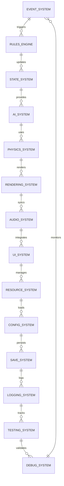

// Copyright (c) 2025 Surviving Gloomspire Development Team
// 
// This file contains both original content and Open Game Content.
// Original content is subject to the MIT License.
// Open Game Content is subject to the Open Game License v1.0.
// 
// The Open Game Content in this file consists of system architecture and Pathfinder mechanics.
// 
// Open Game License v1.0 can be found at http://paizo.com/pathfinderRPG/ogl

# Surviving Gloomspire Architecture

## Core Foundation

### 1. Infrastructure Layer
- **Event System** (`IEventSystem`)
  - Reactive programming foundation
  - Publish-subscribe pattern
  - System communication backbone
  - Async event handling
  - Event filtering and routing
  - Event prioritization

- **Logging System** (`ILoggingSystem`)
  - Structured logging
  - Configurable verbosity levels
  - Debug, Info, Warning, Error, Critical
  - Log rotation and archiving
  - Performance monitoring
  - Error tracking and reporting
  - Distributed tracing support

- **Save System** (`ISaveSystem`)
  - Incremental save system
  - Version control
  - Data integrity checks
  - Progress tracking
  - Character data management
  - World state persistence
  - Transactional updates
  - Save compression
  - Multi-platform support
  - Cloud sync capability

- **Configuration System** (`IConfigSystem`)
  - Game settings management
  - Platform-specific configurations
  - Runtime configuration updates
  - Validation and sanitization
  - User preferences storage
  - Default configuration handling
  - Configuration versioning

- **Resource Management** (`IResourceManager`)
  - Asset streaming
  - Memory management
  - Cache optimization
  - Resource pooling
  - Loading states
  - Error handling
  - Resource validation
  - Multi-threaded loading
  - Memory profiling

### 2. Core Game Systems
- **Rules Engine** (`IRulesEngine`)
  - Game mechanics implementation
  - Rule validation
  - Action resolution
  - State management
  - Event triggering
  - Effect application
  - Combat calculations
  - Resource management
  - Skill resolution
  - Spell effects
  - Environmental interactions
  - Faction rules
  - Political mechanics
  - Economic systems

- **State Management** (`IStateSystem`)
  - Game state persistence
  - Entity state tracking
  - World state synchronization
  - Transaction handling
  - State validation
  - History tracking
  - Rollback capability
  - State serialization
  - Multiplayer synchronization

- **AI System** (`IAISystem`)
  - Behavior trees
  - Pathfinding
  - Decision making
  - Tactical AI
  - Strategic AI
  - Faction AI
  - Environmental awareness
  - Player adaptation
  - Learning capabilities
  - Performance optimization

- **Physics System** (`IPhysicsSystem`)
  - Collision detection
  - Rigid body simulation
  - Character movement
  - Environmental interactions
  - Damage calculations
  - Force application
  - Constraint handling
  - Performance optimization
  - Multi-threading support

### 3. Presentation Layer
- **Rendering System** (`IRenderingSystem`)
  - Scene management
  - Camera control
  - Post-processing effects
  - Lighting system
  - Shadow mapping
  - Particle effects
  - Environment rendering
  - UI rendering
  - Performance optimization
  - Multi-platform support

- **Audio System** (`IAudioSystem`)
  - Sound engine integration
  - 3D audio positioning
  - Dynamic music system
  - Environmental audio
  - Combat sounds
  - UI sound effects
  - Mobile audio optimization
  - Volume control
  - Audio categories
  - Sound mixing
  - Audio events
  - Distance-based attenuation
  - Occlusion and obstruction
  - Reverb and environmental effects
  - Audio streaming

- **UI/UX System** (`IUIUXSystem`)
  - Mobile-friendly interface
  - Tactical HUD
  - Resource management UI
  - Status effects display
  - Touch controls
  - Keyboard/mouse support
  - Screen adaptation
  - UI scaling
  - Mobile optimization
  - Interface elements
  - Menu system
  - Inventory UI
  - Character sheet UI
  - Combat UI
  - Quest log UI
  - Faction UI
  - Resource management UI
  - Base building UI
  - Status effects display
  - Tooltips and help
  - UI animations
  - UI sound integration

### 4. Gameplay Systems
- **Combat System** (`ICombatSystem`)
  - Turn-based mechanics
  - Initiative tracking
  - Action resolution
  - Damage calculations
  - Status effects
  - Positioning
  - Environmental combat
  - Tactical options
  - Resource management
  - Morale effects
  - Special abilities

- **Resource Management** (`IResourceSystem`)
  - Supply chain
  - Production systems
  - Inventory management
  - Resource gathering
  - Resource conversion
  - Storage systems
  - Resource distribution
  - Resource optimization
  - Trade mechanics

- **Faction System** (`IFactionSystem`)
  - Faction relationships
  - Political influence
  - Power dynamics
  - Diplomacy mechanics
  - Alliance systems
  - Territory control
  - Resource competition
  - Faction development
  - Faction history
  - Faction evolution

- **Quest System** (`IQuestSystem`)
  - Dynamic quest generation
  - Quest progression
  - Quest objectives
  - Reward systems
  - Quest tracking
  - Story integration
  - Faction quests
  - Resource quests
  - Exploration quests
  - Combat quests

### 5. Dark Fantasy Theme Systems
- **Dark Fantasy Theme System** (`IDarkFantasySystem`)
  - Grim aesthetic implementation
  - Dark fantasy visual style
  - Environmental storytelling
  - Atmospheric effects
  - Visual motifs
  - Storytelling elements
  - Environmental lore
  - Historical context
  - Cultural background
  - Faction symbolism
  - Art style integration
  - Sound theme integration
  - UI theme integration
  - Story progression
  - World building
  - Cultural elements
  - Historical events
  - Faction history
  - World lore
  - Environmental narrative

### 6. Multiplayer Systems
- **Network System** (`INetworkSystem`)
  - Multiplayer support
  - Synchronization
  - Anti-cheat
  - Matchmaking
  - Lobby system
  - Cross-platform play
  - Network optimization
  - Error handling
  - Connection management
  - Player tracking

### 7. Testing and Debugging
- **Testing Framework** (`ITestingSystem`)
  - Unit testing
  - Integration testing
  - Performance testing
  - Stress testing
  - Regression testing
  - Automated testing
  - Test coverage
  - Test validation
  - Test reporting

- **Debug Tools** (`IDebugSystem`)
  - Profiling tools
  - Memory analysis
  - Performance monitoring
  - Debug visualization
  - Error tracking
  - Log analysis
  - State inspection
  - Network debugging
  - Resource debugging

## System Dependencies



## Core Principles

1. **Modularity**
   - Clear separation of concerns
   - Independent system development
   - Easy system replacement
   - Minimal dependencies

2. **Scalability**
   - Performance optimization
   - Resource management
   - Multi-threading support
   - Memory efficiency

3. **Maintainability**
   - Clean code practices
   - Consistent architecture
   - Comprehensive documentation
   - Automated testing

4. **Extensibility**
   - Plugin architecture
   - Customizable systems
   - Extensible interfaces
   - Flexible configurations

5. **Performance**
   - Efficient algorithms
   - Resource pooling
   - Cache optimization
   - Multi-threading
   - Memory management

## Development Guidelines

1. **Code Organization**
   - Clear namespace structure
   - Consistent naming conventions
   - Modular component design
   - Interface-based programming

2. **Testing Requirements**
   - Unit tests for all systems
   - Integration tests for dependencies
   - Performance benchmarks
   - Stress testing
   - Regression testing

3. **Documentation Standards**
   - API documentation
   - System architecture
   - Usage examples
   - Performance considerations
   - Known limitations

4. **Performance Targets**
   - 60 FPS minimum
   - Low memory footprint
   - Fast loading times
   - Efficient resource usage
   - Smooth gameplay experience

## Future Expansion

1. **Technical Improvements**
   - Enhanced AI capabilities
   - Improved physics simulation
   - Better graphics optimization
   - Advanced networking features
   - Enhanced debugging tools

2. **Gameplay Features**
   - Expanded faction systems
   - Advanced combat mechanics
   - Complex resource management
   - Dynamic world generation
   - Enhanced story systems

3. **Platform Support**
   - More platform integrations
   - Cloud gaming support
   - VR/AR capabilities
   - Cross-platform features
   - Mobile optimization

4. **Community Features**
   - Better multiplayer systems
   - Enhanced modding support
   - Community tools
   - Content sharing
   - Social features

## Implementation Notes

1. **Performance Considerations**
   - All systems should be optimized for mobile devices
   - Resource usage should be carefully monitored
   - Memory allocation should be minimized
   - CPU usage should be optimized
   - Network traffic should be minimized

2. **Security**
   - All network communications should be encrypted
   - Sensitive data should be protected
   - Anti-cheat measures should be implemented
   - Security updates should be regular
   - User data should be protected

3. **Scalability**
   - Systems should be designed to handle large numbers of entities
   - Resource management should be efficient
   - Network code should be optimized
   - Memory usage should be minimized
   - Performance should be consistent

4. **Maintainability**
   - Code should be well-documented
   - Systems should be modular
   - Dependencies should be minimized
   - Testing should be comprehensive
   - Debugging should be easy

5. **Extensibility**
   - Systems should be designed for future expansion
   - Interfaces should be flexible
   - Components should be reusable
   - Configuration should be easy
   - Customization should be possible

## Conclusion

This architecture provides a solid foundation for developing Surviving Gloomspire while maintaining flexibility for future expansion and adaptation to new requirements. The modular design allows for independent development of systems while maintaining a cohesive overall structure.

- **Audio System** (`IAudioSystem`)
  - Sound engine integration
  - 3D audio positioning
  - Dynamic music system
  - Environmental audio
  - Combat sounds
  - UI sound effects
  - Mobile audio optimization
  - Volume control
  - Audio categories
  - Sound mixing
  - Audio events
  - Distance-based attenuation
  - Occlusion and obstruction
  - Reverb and environmental effects
  - Audio streaming

- **UI/UX System** (`IUIUXSystem`)
  - Mobile-friendly interface
  - Tactical HUD
  - Resource management UI
  - Status effects display
  - Touch controls
  - Keyboard/mouse support
  - Screen adaptation
  - UI scaling
  - Mobile optimization
  - Interface elements
  - Menu system
  - Inventory UI
  - Character sheet UI
  - Combat UI
  - Quest log UI
  - Faction UI
  - Resource management UI
  - Base building UI
  - Status effects display
  - Tooltips and help
  - UI animations
  - UI sound integration

- **Animation System** (`IAnimationSystem`)
  - Character animations
  - Combat animations
  - Environmental animations
  - UI animations
  - Special effects
  - Particle effects
  - Mobile optimization
  - Animation blending
  - State machine
  - Animation events
  - Action-based animations
  - Environmental interactions
  - Combat feedback
  - Skill animations
  - Magic effects
  - Resource interactions
  - Base building animations
  - Faction-specific animations
  - Animation caching
  - Performance optimization

- **Dark Fantasy Theme System** (`IDarkFantasySystem`)
  - Grim aesthetic implementation
  - Dark fantasy visual style
  - Environmental storytelling
  - Atmospheric effects
  - Visual motifs
  - Storytelling elements
  - Environmental lore
  - Historical context
  - Cultural background
  - Faction symbolism
  - Art style integration
  - Sound theme integration
  - UI theme integration
  - Story progression
  - World building
  - Cultural elements
  - Historical events
  - Faction history
  - World lore
  - Environmental narrative

### 2. Gloomspire Core Systems

#### World Management
- **AI Game Master** (`IAIGameMaster`)
  - Dynamic world state
  - Player action tracking
  - Reputation management
  - Quest generation
  - Political event generation

- **Emergent Storytelling System** (`IEmergentStorySystem`)
  - Dynamic story generation
  - Player action response
  - World state adaptation
  - Story progression
  - Character development
  - Faction evolution
  - World events
  - Story branching
  - Player impact tracking
  - Story persistence
  - Event chains
  - Story consequences
  - Dynamic quests
  - Character arcs
  - Faction arcs
  - World arcs
  - Story themes
  - Narrative patterns

- **Political System** (`IPoliticalSystem`)
  - Faction hierarchy
  - Political influence
  - Power struggles
  - Political alliances
  - Diplomacy system
  - Espionage mechanics
  - Political missions
  - Faction control zones
  - Resource control
  - Territory management
  - Political events
  - Power shifts

- **Faction Warfare System** (`IFactionWarfareSystem`)
  - Faction conflict mechanics
  - Territory control
  - Resource warfare
  - Military strength
  - Strategic points
  - Supply lines
  - Siege mechanics
  - Faction alliances
  - War declarations
  - Peace treaties
  - Truces
  - Mercenary systems
  - Resource blockades
  - Territory claims
  - War objectives
  - Victory conditions
  - Faction morale
  - War resources
  - Military units
  - Command structures
  - Battle strategies
  - War economy

- **Intrigue System** (`IIntrigueSystem`)
  - Faction secrets
  - Political plots
  - Espionage missions
  - Assassination mechanics
  - Sabotage mechanics
  - Information gathering
  - Political manipulation
  - Faction betrayal
  - Power plays
  - Resource manipulation

- **Chasm Dive System** (`IChasmDiveSystem`)
  - Procedural dungeon generation
  - Biome-based environment generation
  - Resource gathering mechanics
  - Survival resource management
  - High-stakes extraction mechanics
  - Negative level system
  - Encounter generation
  - Difficulty scaling
  - Loot distribution
  - Resource survival mechanics
  - Extraction point management

- **City Hub System** (`ICityHubSystem`)
  - NPC interaction
  - Quest management
  - Resource trading
  - Base building
  - Faction hubs
  - Safe zones

- **Reputation System** (`IReputationSystem`)
  - Faction relationships
  - NPC interactions
  - Bounty system
  - Quest availability
  - Resource access
  - Chasm dive modifiers

- **Resource Management** (`IResourceSystem`)
  - Base building
  - Crafting system
  - Resource tracking
  - Inventory management
  - Trade system
  - Resource conversion

### 3. Character Systems

#### Core Attributes
- **Attribute System** (`IAttributeSystem`)
  - Base stats (STR, DEX, CON, INT, WIS, CHA)
  - Derived stats
  - Stat progression
  - Racial modifiers

- **AI Behavior System** (`IAIBehaviorSystem`)
  - Enemy AI decision making
  - Tactical combat behavior
  - Dynamic encounter generation
  - NPC behavior patterns
  - Faction-specific behaviors
  - Environmental awareness
  - Tactical movement
  - Resource management AI

- **Skill System** (`ISkillSystem`)
  - Skill ranks
  - Skill checks
  - Skill progression
  - Specialization
  - Cross-class skills

- **Class System** (`IClassSystem`)
  - Action-based progression
  - Class features
  - Ability selection
  - Class-specific mechanics
  - Multi-classing

- **Race System** (`IRaceSystem`)
  - Racial traits
  - Racial abilities
  - Racial modifiers
  - Racial restrictions
  - Cultural background

#### Progression
- **Zero-to-Hero Journey System** (`IZeroToHeroSystem`)
  - Character progression path
  - Milestone achievements
  - Progress tracking
  - Growth visualization
  - Power scaling
  - Resource progression
  - Faction progression
  - Story progression
  - Power curve management
  - Progression balancing
  - Achievement system
  - Progress rewards
  - Progress challenges

- **Character Evolution System** (`ICharacterEvolutionSystem`)
  - Action-based skill development
  - Emergent class specialization
  - Playstyle adaptation
  - Dynamic ability progression

- **Experience System** (`IExperienceSystem`)
  - Action-based XP
  - Chasm dive rewards
  - City interactions
  - Faction missions
  - Resource management
  - Skill specialization XP
  - Playstyle bonus XP

- **Class System** (`IClassSystem`)
  - Action-based progression
  - Class features
  - Ability selection
  - Class-specific mechanics
  - Multi-classing
  - Playstyle adaptation
  - Specialization paths

- **Skill System** (`ISkillSystem`)
  - Skill ranks
  - Skill checks
  - Skill progression
  - Specialization
  - Cross-class skills
  - Action-based improvement
  - Playstyle bonuses

- **Talent System** (`ITalentSystem`)
  - Talent trees
  - Playstyle specialization
  - Class-specific talents
  - Cross-class talents
  - Action-based unlock
  - Resource cost
  - Talent synergies

### 4. Combat Systems

#### Core Combat
- **Initiative System** (`IInitiativeSystem`)
  - Turn order
  - Action timing
  - Surprise mechanics
  - Stealth detection

- **Combat Manager** (`ICombatSystem`)
  - Round management
  - Action resolution
  - Damage calculation
  - Status effects
  - Movement tracking

- **Damage System** (`IDamageSystem`)
  - Damage types
  - Damage calculation
  - Damage reduction
  - Critical hits
  - Damage over time

- **Condition System** (`IConditionSystem`)
  - Status effects
  - Debuffs
  - Buffs
  - Duration tracking
  - Effect stacking

#### Advanced Combat
- **Combat Maneuvers** (`ICombatManeuverSystem`)
  - Special attacks
  - Grappling
  - Tripping
  - Disarming
  - Feinting

- **Cover System** (`ICoverSystem`)
  - Line of sight
  - Cover types
  - Stealth mechanics
  - Movement penalties
  - Attack modifiers

### 5. Magic Systems

#### Core Magic
- **Spell System** (`ISpellSystem`)
  - Spell casting
  - Spell effects
  - Duration tracking
  - Area of effect
  - Damage calculation

- **Spellbook System** (`ISpellbookSystem`)
  - Spell learning
  - Spell preparation
  - Spell slots
  - Spell recovery
  - Spell customization

- **Magic Item System** (`IMagicItemSystem`)
  - Item properties
  - Item effects
  - Item creation
  - Item enhancement
  - Item identification

#### Advanced Magic
- **Concentration System** (`IConcentrationSystem`)
  - Spell maintenance
  - Concentration checks
  - Multi-spell casting
  - Interruption mechanics
  - Spell failure

- **Magic School System** (`IMagicSchoolSystem`)
  - School specialization
  - School restrictions
  - School synergies
  - School advancement
  - School-specific abilities

### 6. Equipment Systems

#### Core Equipment
- **Inventory System** (`IInventorySystem`)
  - Item storage
  - Weight tracking
  - Item organization
  - Container management
  - Resource tracking

- **Equipment System** (`IEquipmentSystem`)
  - Item equipping
  - Stat modifiers
  - Equipment slots
  - Item compatibility
  - Set bonuses

#### Advanced Equipment
- **Item Effect System** (`IItemEffectSystem`)
  - Item abilities
  - Effect stacking
  - Duration tracking
  - Trigger conditions
  - Effect interactions

- **Durability System** (`IDurabilitySystem`)
  - Item wear
  - Repair mechanics
  - Quality degradation
  - Enhancement limits
  - Maintenance requirements

### 7. World Systems

#### Core World
- **Grid System** (`IGridSystem`)
  - Movement tracking
  - Position management
  - Area of effect
  - Line of sight
  - Pathfinding

- **Environment System** (`IEnvironmentSystem`)
  - Terrain effects
  - Environmental hazards
  - Weather effects
  - Time of day
  - Lighting conditions

#### Advanced World
- **Lighting System** (`ILightingSystem`)
  - Dynamic lighting
  - Light sources
  - Shadows
  - Visibility
  - Stealth mechanics

- **Weather System** (`IWeatherSystem`)
  - Weather effects
  - Weather transitions
  - Environmental modifiers
  - Combat effects
  - Resource gathering

### 8. Game Flow Systems

#### Core Flow
- **Turn System** (`ITurnSystem`)
  - Initiative tracking
  - Action management
  - Round progression
  - Time tracking
  - Action economy

- **Action System** (`IActionSystem`)
  - Action types
  - Action costs
  - Action combinations
  - Action restrictions
  - Action recovery

#### Advanced Flow
- **Quest System** (`IQuestSystem`)
  - Quest generation
  - Quest tracking
  - Quest rewards
  - Quest progression
  - Dynamic objectives

- **Dialogue System** (`IDialogueSystem`)
  - NPC conversations
  - Dialogue branching
  - Choice consequences
  - Reputation effects
  - Faction interactions

- **Faction System** (`IFactionSystem`)
  - Faction relationships
  - Faction missions
  - Faction benefits
  - Faction penalties
  - Faction progression

### Technical Requirements

#### Platform Support
- **Cross-Platform System** (`ICrossPlatformSystem`)
  - PC support
  - Mobile support
  - Touch controls
  - Keyboard/mouse support
  - Mobile optimization
  - Screen size adaptation
  - Input system
  - Platform-specific features

#### Performance Optimization
- **Performance System** (`IPerformanceSystem`)
  - Mobile optimization
  - Asset streaming
  - LOD management
  - Memory management
  - CPU optimization
  - GPU optimization
  - Battery management
  - Resource caching

#### Content Generation
- **Content System** (`IContentSystem`)
  - Procedural generation
  - Dynamic content
  - Content streaming
  - Asset management
  - Resource pooling
  - Content caching
  - Dynamic loading

#### AI Behavior
- **AI System** (`IAISystem`)
  - Dynamic behavior
  - Pathfinding optimization
  - Combat AI
  - NPC behavior
  - Faction AI
  - Environmental awareness
  - Resource management AI

## System Interaction

### Core System Interactions

```mermaid
graph TD
    %% Core Systems
    subgraph Core[Core Systems]
        A1[Rules Engine] <-->|Validates| A2[Dice System]
        A1 <-->|Processes| A3[Effect System]
        A1 <-->|Manages| A4[Time System]
        A1 <-->|Triggers| A5[Event System]
        A1 <-->|Saves/Loads| A6[Save System]
    end

    %% Character Systems
    subgraph Character[Character Systems]
        B1[Attributes] <-->|Uses| B2[Skills]
        B1 <-->|Affects| B3[Feats]
        B4[Classes] <-->|Grants| B3
        B4 <-->|Modifies| B1
        B5[Races] <-->|Modifies| B1
        B6[Experience] <-->|Levels| B4
        B6 <-->|Tracks| B7[Alignment]
    end

    %% Combat Systems
    subgraph Combat[Combat Systems]
        C1[Initiative] -->|Starts| C2[Combat Manager]
        C2 -->|Processes| C3[Damage]
        C2 -->|Tracks| C4[Conditions]
        C2 -->|Resolves| C5[Attacks of Opportunity]
        C2 -->|Manages| C6[Combat Maneuvers]
        C2 -->|Considers| C7[Cover]
    end

    %% Magic Systems
    subgraph Magic[Magic Systems]
        D1[Spells] <-->|Uses| D2[Spellbook]
        D1 <-->|Requires| D3[Spell Preparation]
        D1 <-->|Consumes| D4[Spell Slots]
        D1 <-->|Maintains| D5[Concentration]
        D1 <-->|Categorizes| D6[Magic Schools]
        D7[Magic Items] <-->|Contains| D1
    end

    %% Equipment Systems
    subgraph Equipment[Equipment Systems]
        E1[Inventory] <-->|Manages| E2[Equipment Slots]
        E1 <-->|Applies| E3[Item Effects]
        E1 <-->|Tracks| E4[Encumbrance]
        E1 <-->|Monitors| E5[Durability]
        E1 <-->|Organizes| E6[Containers]
    end

    %% World Systems
    subgraph World[World Systems]
        F1[Map/Grid] <-->|Provides| F2[Line of Sight]
        F1 <-->|Enables| F3[Pathfinding]
        F4[Environment] <-->|Affects| F5[Lighting]
        F4 <-->|Controls| F6[Weather]
        F4 <-->|Updates| F7[Time of Day]
    end

    %% Game Flow
    subgraph GameFlow[Game Flow]
        G1[Turn Order] <-->|Manages| G2[Action Economy]
        G1 <-->|Updates| G3[Game State]
        G4[Quests] <-->|Influences| G3
        G5[Dialogue] <-->|Affects| G4
        G6[Factions] <-->|Influence| G7[Reputation]
    end

    %% System Interactions
    Core -->|Validates| Character
    Core -->|Processes| Combat
    Core -->|Manages| Magic
    Core -->|Manages| World
    Core -->|Controls| GameFlow
    Character -->|Engages in| Combat
    Character -->|Uses| Magic
    Character -->|Equips| Equipment
    Character -->|Interacts with| World
    Combat -->|Affects| Character
    Combat -->|Triggers| Magic
    Magic -->|Modifies| Combat
    Magic -->|Enhances| Equipment
    Equipment -->|Affects| Character
    Equipment -->|Modifies| Combat
    World -->|Hosts| Character
    World -->|Affects| Combat
    World -->|Influences| Magic
    GameFlow -->|Orchestrates| Core
    GameFlow -->|Tracks| Character
    GameFlow -->|Controls| Combat
    GameFlow -->|Manages| Magic
    GameFlow -->|Updates| World

    subgraph Combat[Combat Systems]
        C1[Initiative] -->|Starts| C2[Combat Manager]
        C2 -->|Processes| C3[Damage]
        C2 -->|Tracks| C4[Conditions]
        C2 -->|Resolves| C5[Attacks of Opportunity]
        C2 -->|Manages| C6[Combat Maneuvers]
        C2 -->|Considers| C7[Cover]
    end

    %% Magic Systems
    subgraph Magic[Magic Systems]
        D1[Spells] <-->|Uses| D2[Spellbook]
        D1 <-->|Requires| D3[Spell Preparation]
        D1 <-->|Consumes| D4[Spell Slots]
        D1 <-->|Maintains| D5[Concentration]
        D1 <-->|Categorizes| D6[Magic Schools]
        D7[Magic Items] <-->|Contains| D1
    end

    %% Equipment Systems
    subgraph Equipment[Equipment Systems]
        E1[Inventory] <-->|Manages| E2[Equipment Slots]
        E1 <-->|Applies| E3[Item Effects]
        E1 <-->|Tracks| E4[Encumbrance]
        E1 <-->|Monitors| E5[Durability]
        E1 <-->|Organizes| E6[Containers]
    end

    %% World Systems
    %% System Interactions
    Gloomspire -->|Influences| ChasmDive
    Gloomspire -->|Affects| Resources
    ChasmDive -->|Generates| Resources
    Resources -->|Supports| Gloomspire
    Resources -->|Enables| Character Progression
    Character Progression -->|Influences| ChasmDive
```

### Gloomspire-Specific System Interactions

```mermaid
graph TD
    %% Gloomspire Core Systems
    subgraph Gloomspire[Gloomspire Core]
        A1[AI Game Master] <-->|Tracks| A2[Player Actions]
        A1 <-->|Generates| A3[Emergent Stories]
        A1 <-->|Manages| A4[Faction Relationships]
        A1 <-->|Affects| A5[Chasm Dives]
        A1 <-->|Influences| A6[City Hub]
        A1 <-->|Updates| A7[Reputation]
        A1 <-->|Generates| A8[Political Events]
        A1 <-->|Manages| A9[World State]
    end

    %% Chasm Dive System
    subgraph ChasmDive[Chasm Dive System]
        B1[Procedural Generation] <-->|Creates| B2[Environments]
        B1 <-->|Spawns| B3[Encounters]
        B1 <-->|Manages| B4[Resources]
        B1 <-->|Controls| B5[Difficulty]
        B1 <-->|Handles| B6[Extraction]
        B1 <-->|Manages| B7[Survival]
        B1 <-->|Controls| B8[Negative Levels]
    end

    %% Resource Management
    subgraph Resources[Resource Management]
        C1[Base Building] <-->|Uses| C2[Resources]
        C1 <-->|Produces| C3[Crafting]
        C1 <-->|Manages| C4[Upgrades]
        C1 <-->|Affects| C5[Character Progression]
        C1 <-->|Manages| C6[Faction Relations]
        C1 <-->|Affects| C7[World State]
    end

    %% Political System
    subgraph Politics[Political System]
        D1[Faction Warfare] <-->|Affects| D2[Territory]
        D1 <-->|Manages| D3[Resources]
        D1 <-->|Controls| D4[Power]
        D1 <-->|Influences| D5[Quests]
        D1 <-->|Affects| D6[Reputation]
    end

    %% System Interactions
    Gloomspire -->|Influences| ChasmDive
    Gloomspire -->|Affects| Resources
    Gloomspire -->|Influences| Politics
    ChasmDive -->|Generates| Resources
    Resources -->|Supports| Gloomspire
    Resources -->|Enables| Character Progression
    Character Progression -->|Influences| ChasmDive
    Politics -->|Affects| Resources
    Politics -->|Influences| World State
    World State -->|Affects| ChasmDive
    World State -->|Influences| Politics
```

## Key Design Patterns

1. **Component-Entity-System (CES)**
   - Entities: Game objects (characters, items, etc.)
   - Components: Data containers
   - Systems: Logic that acts on components

2. **Event Bus**
   - Decouples system communication
   - Handles game events (combat, spells, etc.)

3. **Service Locator**
   - Central access to game systems
   - Easy dependency injection

## Implementation Notes

- All systems are interface-based
- Systems are stateless where possible
- Heavy use of composition over inheritance
- Event-driven architecture for game mechanics

---
*Last Updated: 2025-06-10*
