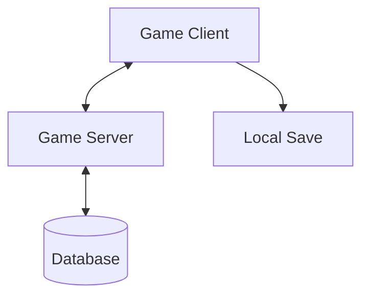

# Technical Overview

## Technology Stack

### Core Technologies
- **Game Engine**: Unreal Engine 5.6
- **Programming Languages**:
  - C++ (Core systems)
  - Blueprints (Gameplay logic)
- **Version Control**: Git with LFS
- **Project Management**: [Tool Name] (e.g., Jira, Trello)
  
### Development Tools
- **IDE**: Visual Studio 2022
- **3D Modeling**: [Tool Name] (e.g., Blender, Maya)
- **2D Art**: [Tool Name] (e.g., Photoshop, Aseprite)
- **Version Control Client**: GitHub Desktop / GitKraken

## System Architecture

### High-Level Architecture

### Core Systems
1. **Game State Management**
   - Manages game flow and state transitions
   - Handles save/load functionality

2. **Entity Component System**
   - Flexible entity composition
   - Efficient data-oriented design

3. **Input System**
   - Multi-platform input handling
   - Rebindable controls
   - Input buffering

## Data Management

### Save System
- **Local Saves**: JSON-based save files
- **Cloud Saves**: Steam Cloud integration
- **Save Slots**: Multiple save slots support

### Asset Management
- **Asset Naming Convention**: `Prefix_Description_Variant`
- **Import Settings**: Standardized presets
- **Asset Validation**: Automated checks

## Networking
- **Architecture**: Client-server model
- **Replication**: Optimized for 2D gameplay
- **Prediction**: Client-side prediction for responsive controls

## Performance Targets
| Platform | Target FPS | Resolution | Notes |
|----------|------------|------------|-------|
| PC (Min) | 60 FPS | 1280x720 | Low settings |
| PC (Rec) | 60 FPS | 1920x1080 | High settings |

## Build Pipeline
1. **Development Builds**: Frequent, with debug symbols
2. **QA Builds**: Weekly, with performance profiling
3. **Release Candidates**: Feature complete, bug fixes only

## Dependencies
- **Engine Plugins**:
  - Paper2D
  - Gameplay Abilities
  - Online Subsystem
- **Third-Party Libraries**:
  - [List any external libraries]

## Development Environment
### Prerequisites
- Windows 10/11 (64-bit)
- Visual Studio 2022
- Unreal Engine 5.6
- Git LFS

### Setup Instructions
1. Clone the repository
2. Run `Setup.bat`
3. Generate project files
4. Open in Visual Studio

## Troubleshooting
### Common Issues
1. **Missing Dependencies**
   - Run `Setup.bat`
   - Verify Git LFS installation

2. **Build Failures**
   - Clean and rebuild solution
   - Verify Visual Studio components

---
*Document Version: 1.0*  
*Last Updated: 2025-06-23*
