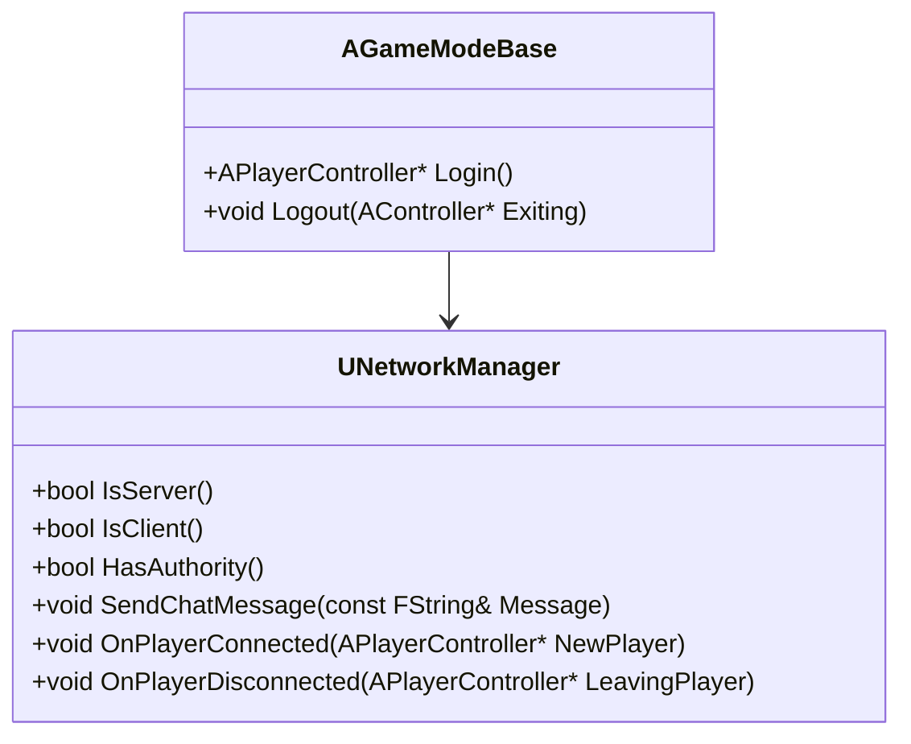

# Network Architecture

## Overview
This document outlines the network architecture for the Pathfinder 1e implementation, focusing on replication, authority, and synchronization in a multiplayer environment.

## Network Model

### Server-Client Architecture
- **Dedicated Server**: Authoritative game state
- **Clients**: Predictive client-side simulation
- **Listen Server**: Optional local hosting mode

### Replication Framework
- **Actor Replication**: Core game objects
- **Component Replication**: Modular functionality
- **RPCs**: Remote procedure calls for gameplay events

## Core Systems

### 1. Network Manager


### 2. Replicated Actor
```cpp
// Base class for replicated actors
UCLASS()
class AReplicatedActor : public AActor
{
    GENERATED_BODY()
    
public:
    // Replicated properties
    UPROPERTY(Replicated, BlueprintReadOnly, Category = "Network")
    FString ReplicatedName;
    
    // Server RPC
    UFUNCTION(Server, Reliable, WithValidation)
    void ServerUpdateState(const FString& NewState);
    
    // Multicast RPC
    UFUNCTION(NetMulticast, Reliable)
    void MulticastUpdateState(const FString& NewState);
    
    // Client RPC
    UFUNCTION(Client, Reliable)
    void ClientReceiveMessage(const FString& Message);
};
```

## Replication Strategy

### 1. State Replication
- **Relevant Actors Only**: Only replicate visible/important actors
- **Priority System**: Important updates first
- **Frequency Capping**: Limit update rates for non-critical data

### 2. Client-Side Prediction
- **Movement**: Predictive movement with server reconciliation
- **Abilities**: Client-side activation with server validation
- **Correction**: Smooth correction for prediction errors

### 3. Bandwidth Optimization
- **Delta Compression**: Only send changed properties
- **Relevancy**: Only replicate to relevant clients
- **Priority**: Important updates first

## Security

### 1. Validation
- Server-side validation of all client inputs
- Anti-cheat measures
- Rate limiting

### 2. Data Verification
- Checksums for critical data
- State validation
- Desync detection and recovery

## Performance Considerations

### 1. Network Profiling
- Monitor bandwidth usage
- Track replication overhead
- Identify optimization opportunities

### 2. Optimization Techniques
- Property replication conditions
- Replication graph
- Channel prioritization

## Implementation Guidelines

### 1. Replication Setup
```cpp
// In header
UCLASS()
class AMyActor : public AActor
{
    GENERATED_BODY()
    
    // Replicated property
    UPROPERTY(ReplicatedUsing = OnRep_Health)
    float Health;
    
    // Replication notification
    UFUNCTION()
    void OnRep_Health();
};

// In cpp
void AMyActor::GetLifetimeReplicatedProps(TArray<FLifetimeProperty>& OutLifetimeProps) const
{
    Super::GetLifetimeReplicatedProps(OutLifetimeProps);
    
    // Replicate to all clients
    DOREPLIFETIME(AMyActor, Health);
}
```

### 2. RPC Implementation
```cpp
// Server RPC with validation
bool AMyActor::ServerUpdateState_Validate(const FString& NewState)
{
    // Validate input
    return !NewState.IsEmpty() && NewState.Len() < 256;
}

void AMyActor::ServerUpdateState_Implementation(const FString& NewState)
{
    // Apply state change
    CurrentState = NewState;
    
    // Notify all clients
    MulticastUpdateState(NewState);
}
```

## Testing and Debugging

### 1. Network Testing
- Test with various network conditions
- Verify client prediction
- Stress test with multiple clients

### 2. Debug Tools
- Network profiler
- Replication graph visualization
- Packet logging

---
*Document Version: 1.0*  
*Last Updated: 2025-06-23*
