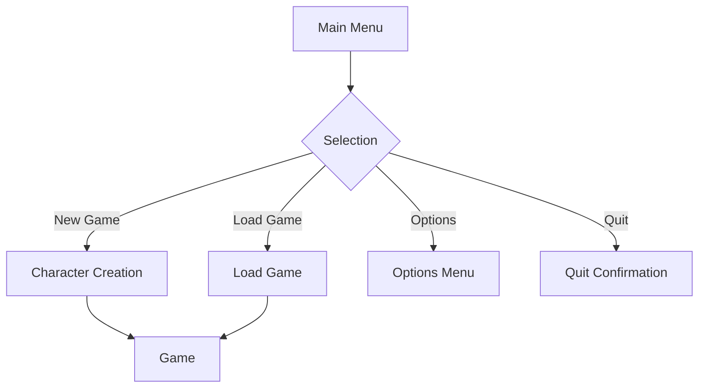
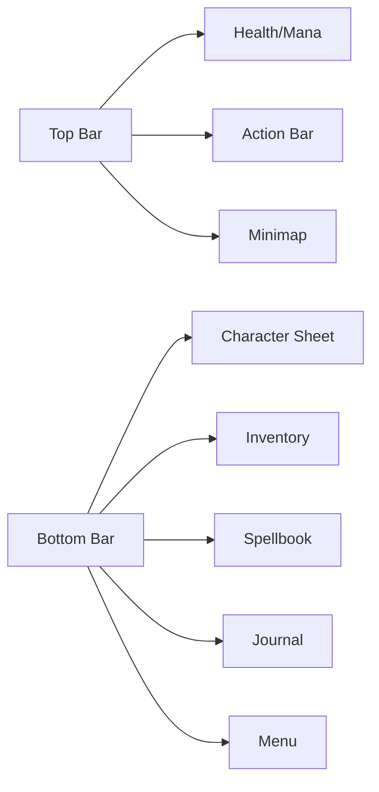
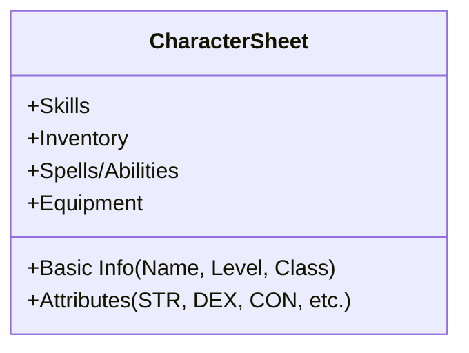

# UI/UX Design Documentation

## Overview
This document outlines the user interface and experience design for Surviving Gloomspire, focusing on usability, accessibility, and maintaining a classic tabletop RPG feel in a digital format.

## Design Principles

### 1. Core Principles
- **Clarity**: Information should be clear and easy to understand
- **Consistency**: Maintain visual and functional consistency across all screens
- **Efficiency**: Minimize clicks/taps for common actions
- **Feedback**: Provide clear feedback for user actions
- **Accessibility**: Support various input methods and accessibility needs

### 2. Visual Style
- **Art Style**: Hand-drawn, parchment-like aesthetic
- **Color Palette**: 
  - Primary: Deep blues and golds
  - Secondary: Earth tones
  - Accents: Deep reds and greens
- **Typography**: 
  - Headings: Medieval-style serif
  - Body: Readable sans-serif
  - Game Text: Typewriter-style monospace

## Screen Flows

### 1. Main Menu Flow


### 2. In-Game HUD


## Key Screens

### 1. Character Creation
- **Purpose**: Guide players through character creation
- **Flow**: Race → Class → Abilities → Skills → Feats → Equipment → Review
- **Components**:
  - 3D character preview
  - Stat allocation panel
  - Description panel
  - Navigation controls

### 2. In-Game HUD
- **Health/Mana Bars**: Top-left corner
- **Minimap**: Top-right corner
- **Action Bar**: Bottom-center
- **Context Menu**: Right-click menu for interactions
- **Tooltips**: On-hover information

### 3. Inventory System
- **Grid-based** inventory with drag-and-drop
- **Categories**: Weapons, Armor, Consumables, Quest Items
- **Tooltips**: Item details on hover
- **Quick Access**: Hotbar for frequently used items

## UI Components

### 1. Common Elements
- **Buttons**: Clear visual states (normal, hover, pressed, disabled)
- **Sliders**: For volume and other settings
- **Dropdowns**: For selections with multiple options
- **Tooltips**: Contextual help and information
- **Modals**: For important decisions or information

### 2. Character Sheet


## Input Handling

### 1. PC Controls
- **Mouse**: Primary interaction
- **Keyboard**: Hotkeys for common actions
- **Gamepad**: Full controller support

### 2. Console Controls
- **D-pad/Stick**: Navigation
- **Face Buttons**: Primary actions
- **Shoulder Buttons**: Secondary actions
- **Menu Button**: Pause/Options

## Accessibility Features

### 1. Visual
- Text scaling
- High contrast mode
- Colorblind modes
- Subtitles and closed captions

### 2. Audio
- Separate volume controls
- Visual cues for audio events
- Subtitle customization

### 3. Input
- Rebindable controls
- Multiple input methods
- Input assistance

## Mockups

### 1. Main Menu
```
+-------------------------------------+
|                                     |
|       SURVIVING GLOOMSPIRE          |
|                                     |
|           [NEW GAME]                |
|           [LOAD GAME]               |
|           [OPTIONS]                 |
|           [QUIT]                    |
|                                     |
+-------------------------------------+
```

### 2. In-Game HUD
```
+-------------------------------------+
| Health: [#######   ] 70%           |
| Mana:   [######### ] 90%           |
|                                     |
|                [Minimap]            |
+-------------------------------------+
|                                     |
|                                     |
|                                     |
|                                     |
| [1][2][3][4][5][6][7][8][9][0]      |
+-------------------------------------+
| Char | Inv | Spells | Journal | Menu |
+-------------------------------------+
```

## Implementation Guidelines

### 1. Unreal Motion Graphics (UMG)
- Use Widget Blueprints for UI elements
- Implement event-based updates
- Use data binding for dynamic content

### 2. Performance
- Implement object pooling for frequently used elements
- Use texture atlases
- Optimize draw calls

## Testing Plan

### 1. Usability Testing
- Navigation flow
- Readability
- Input responsiveness

### 2. Performance Testing
- Memory usage
- Frame rate impact
- Load times

---
*Document Version: 1.0*  
*Last Updated: 2025-06-23*
