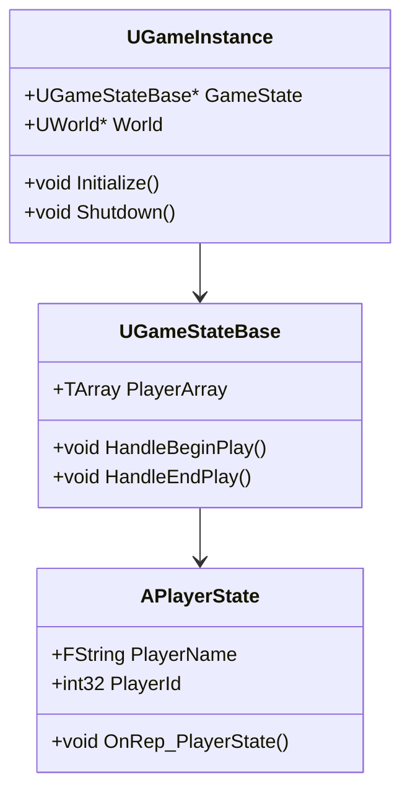
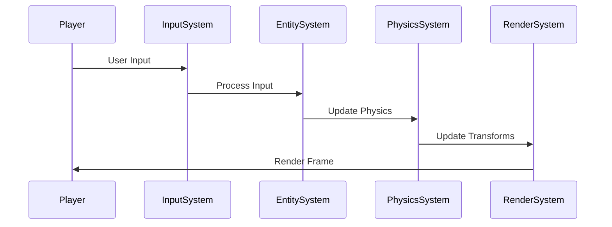

# Core Architecture

## Overview
This document outlines the core architectural decisions and patterns for the Pathfinder 1e implementation in Unreal Engine 5.

## Architectural Patterns

### 1. Component-Based Architecture
- **Entity-Component-System (ECS) Pattern**
  - Game objects are composed of reusable components
  - Components contain only data and no behavior
  - Systems process components to implement behavior

### 2. Event-Driven Design
- **Event Bus System**
  - Decoupled communication between systems
  - Asynchronous event handling
  - Support for event queuing and prioritization

### 3. Game State Management
- **State Pattern**
  - Clear separation between different game states
  - Easy to add new states without modifying existing code
  - Support for state transitions and history

## Core Systems

### 1. Game Framework

### 2. Entity System
- **Base Entity Class**
  - Lightweight base for all game objects
  - Unique identifier (GUID)
  - Component management

- **Component Types**
  - TransformComponent: Position, rotation, scale
  - StatsComponent: Character attributes and stats
  - InventoryComponent: Item management
  - AbilitySystemComponent: Gameplay abilities and effects

### 3. Save System
- **Save Game Architecture**
  - JSON-based serialization
  - Support for partial saves/loads
  - Version control for save files

## Data Flow

## Performance Considerations
- **Memory Management**
  - Object pooling for frequently created/destroyed objects
  - Efficient component storage (SoA vs AoS)
  - Lazy loading of assets

- **Multithreading**
  - Job system for parallel processing
  - Thread-safe event queue
  - Async asset loading

## Dependencies
- Unreal Engine 5.6
- Gameplay Ability System Plugin
- Common UI Plugin
- Paper2D Plugin

---
*Document Version: 1.0*  
*Last Updated: 2025-06-23*
