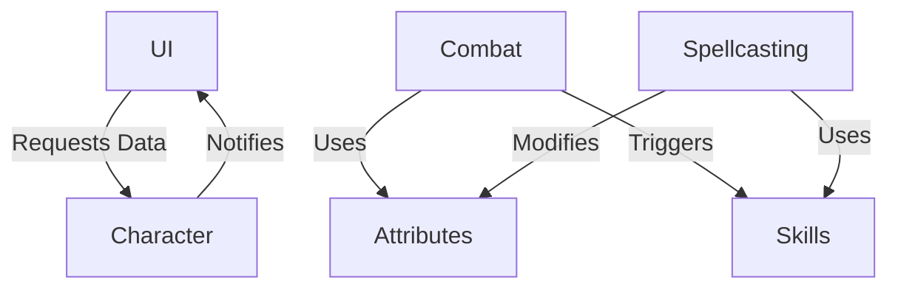
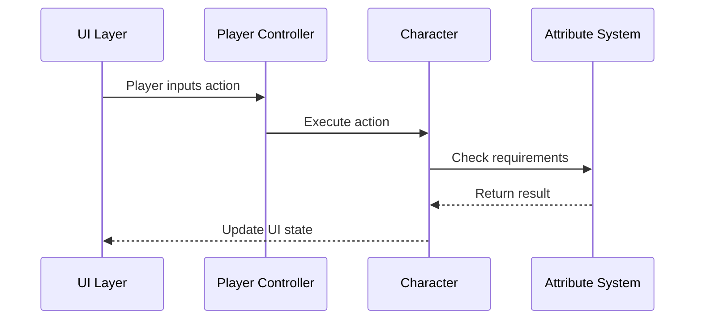

# Modular Design Principles

## Overview
This document outlines the architectural principles and patterns used to create a flexible, maintainable implementation of Pathfinder 1e in Unreal Engine 5.

## Core Principles

### 1. Separation of Concerns
- Each module handles a specific aspect of the game
- Clear interfaces between modules
- Minimize cross-module dependencies

### 2. Component-Based Architecture
- Entity-Component-System (ECS) pattern
- Composition over inheritance
- Runtime flexibility

### 3. Data-Driven Design
- Game data separate from code
- Easy content creation and balancing
- Hot-reloading support

## Module Organization

### Core Modules
- **Attributes**: Base character statistics
- **Combat**: Turn-based combat system
- **Skills**: Skill checks and progression
- **Spellcasting**: Magic system implementation
- **Inventory**: Items and equipment
- **AI**: Non-player character behavior
- **UI**: User interface elements
- **Save/Load**: Game state persistence

### Module Communication

## Design Patterns

### 1. Observer Pattern
- Used for event handling
- Decouples event sources from consumers
- Example: Character health changes notify UI and AI systems

### 2. Factory Pattern
- Creates objects without specifying exact class
- Used for spawning items, abilities, and effects
- Enables data-driven content creation

### 3. Strategy Pattern
- Encapsulates algorithms
- Makes them interchangeable
- Example: Different AI behaviors for different monster types

## Data Flow

### Character Data Flow

## Error Handling

### Error Categories
1. **Input Validation**
   - Verify all inputs at module boundaries
   - Provide clear error messages
   - Fail fast and fail clearly

2. **Runtime Errors**
   - Log detailed error information
   - Graceful degradation when possible
   - Auto-recovery mechanisms

### Logging Strategy
- Use UE_LOG with appropriate verbosity levels
- Structured logging for analytics
- Performance metrics collection

## Performance Considerations

### Memory Management
- Object pooling for frequently created/destroyed objects
- Efficient data structures
- Memory usage monitoring

### Optimization Strategies
- Lazy loading of assets
- Level streaming
- Async operations for non-critical tasks

## Testing Strategy

### Unit Tests
- Test individual components in isolation
- Mock dependencies
- Automated test suite

### Integration Tests
- Test module interactions
- Verify data flow between systems
- Automated regression testing

## Documentation Standards

### Code Documentation
- Doxygen-style comments for all public interfaces
- Clear function/method documentation
- Example usage where helpful

### Design Documents
- Architecture Decision Records (ADRs)
- Module specifications
- Data flow diagrams

## Version Control

### Branching Strategy
- Feature branches for development
- Pull request reviews
- Semantic versioning for releases

### Asset Management
- Proper asset naming conventions
- Directory structure organization
- Asset validation on check-in

## Related Documents
- [Component-Based Architecture](component_system.md)
- [Data Structures](data_structures.md)

---
*Document Version: 1.0*  
*Last Updated: 2023-11-15*
