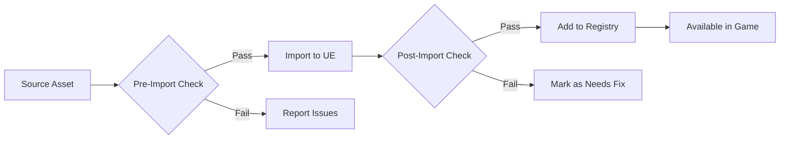

# Asset Validation System

## Overview
This document outlines the automated and manual validation processes to ensure all assets meet the project's quality standards before being committed to the repository.

## Validation Levels

### 1. Pre-Import Validation
Checks performed before assets enter the project:
- File naming conventions
- File format and version
- Basic metadata validation

### 2. Post-Import Validation
Checks after Unreal imports the asset:
- Texture dimensions and formats
- Material parameters
- Mesh topology and UVs
- Skeletal mesh bone hierarchy

### 3. Runtime Validation
Checks during gameplay:
- Asset references
- Performance metrics
- Memory usage

## Validation Tools

### 1. Editor Utility Widgets
- **Asset Naming Validator**
  - Checks against naming conventions
  - Suggests renames
  - Batch rename capability

- **Texture Validator**
  - Resolution checks
  - Color space validation
  - Mipmap settings
  - Compression settings

- **Mesh Validator**
  - Triangle count
  - UV sets
  - LOD validation
  - Collision setup

### 2. Python Scripts
```python
# Example: Texture validation script
def validate_texture(texture):
    issues = []
    if texture.max_size > 4096:
        issues.append("Texture exceeds max size of 4096")
    if texture.compression_settings != "BC7":
        issues.append("Incorrect compression setting")
    return issues
```

### 3. Commandlet
```
UE4Editor.exe ProjectName -run=AssetCheck -type=textures -maxsize=4096
```

## Validation Rules

### Textures
| Rule | Check | Action |
|------|-------|--------|
| Resolution | Power of two | Warning |
| Format | BC7 for color | Error |
| Mipmaps | Enabled for 3D | Warning |
| sRGB | Correct setting | Error |

### Static Meshes
| Rule | Check | Action |
|------|-------|--------|
| Tris | < 100k | Warning |
| UVs | No overlaps | Error |
| Origin | Centered | Warning |
| Scale | 1.0 | Error |

### Materials
| Rule | Check | Action |
|------|-------|--------|
| Shader Model | SM5+ | Error |
| Parameters | Named correctly | Warning |
| Instances | Used | Warning |
| Textures | Power of two | Warning |

## Implementation

### 1. Asset Registry
- Track all assets and their metadata
- Monitor dependencies
- Flag outdated assets

### 2. Validation Pipeline


### 3. Automated Checks
- **Pre-commit Hooks**
  - Validate asset naming
  - Check file sizes
  - Verify metadata

- **CI/CD Pipeline**
  - Run validation on all assets
  - Generate reports
  - Block problematic commits

## Error Handling

### Error Levels
1. **Error** - Must fix before commit
2. **Warning** - Should fix, but won't block
3. **Info** - Suggestion for improvement

### Reporting
- HTML/PDF reports
- JIRA integration
- Email notifications
- Dashboard visualization

## Performance Considerations

### Validation Speed
- Cache results
- Parallel processing
- Incremental validation

### Memory Usage
- Process assets in chunks
- Clear temporary data
- Monitor resource usage

## Custom Validators

### Creating a Validator
1. Create a class that implements `IAssetValidator`
2. Register with the asset registry
3. Implement validation logic

### Example: Texture Validator
```cpp
UCLASS()
class UTextureValidator : public UObject, public IAssetValidator
{
    GENERATED_BODY()
    
    virtual EAssetValidationResult ValidateLoadedAsset(
        UObject* InAsset,
        TArray<FText>& ValidationErrors) override;
};
```

## Testing

### Unit Tests
- Test each validation rule
- Edge cases
- Error conditions

### Integration Tests
- Full asset pipeline
- Multiple asset types
- Dependency validation

## Documentation

### For Artists
- How to fix common issues
- Naming conventions
- Best practices

### For Developers
- Adding new validators
- Extending the system
- Debugging tips

## Monitoring

### Metrics
- Number of validation errors
- Time spent validating
- Most common issues

### Trends
- Error rates over time
- Impact of new validators
- Team performance

---
*Document Version: 1.0*  
*Last Updated: 2025-06-23*
